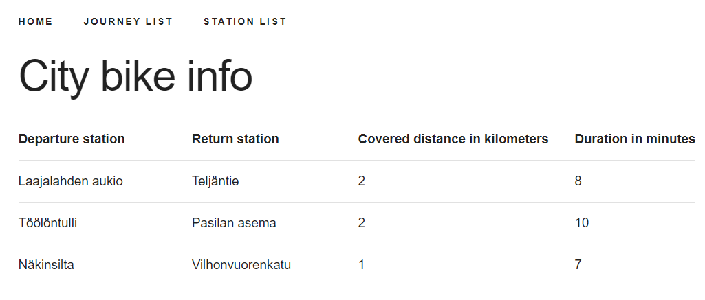
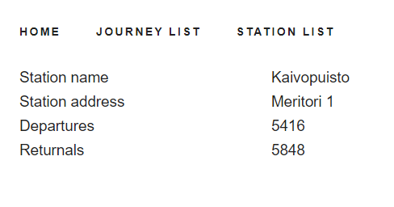

# Pre-assignment for Solita

This repository contains the code for a Citybike app
pre-assignment for Solita.





## Technologies

This project uses Docker to glue different services together and
to help with installation of different tools, PostgreSQL as the database,
Node.js and Express.js in the server, and React in the front-end.
It also includes [Skeleton CSS](http://getskeleton.com/) as a CSS boilerplate
to make things look nice.

## Running locally

### Prerequisites

The CSV data is included in a zip file in this repository, in [Backend/SolitaDevPre.zip](Backend/SolitaDevPre.zip). This file needs to be manually unzipped to folder Backend/SolitaDevPre,
so that the database migrations can use that data.

This project is configured to run with [Docker](https://docs.docker.com/engine/install/) and `docker-compose`, which needs to be installed.

## Starting Database and Backend and Frontend servers

When Docker is installed, you can simply run `./start.sh` at the root of the project.
Or `./start.bat` on Windows.

This will download the relevant Docker images and initialize the PostgreSQL database
with the citybike and journey data from CSVs. The relevant database migrations
can be found in [./Backend/db-init](./Backend/db-init/) folder.  
After the database is up, Docker will also spin up two Node.js containers for
the backend and the frontend, install their dependencies, and start both. This may take
a few minutes. Node.js does not need to be installed in the host system for this to work.

After everything is set up, the project can be accessed in the browser at
http://localhost:3000.

## Local development and tests

The docker setup makes it easy to demo a finished application, but for more active development,
Node.js should be installed in the host system and the server and the frontend should be
started with it. The database can still use docker, with `docker-compose up -d` in the
Backend folder.

With Node.js installed, you can run in the Backend folder

```sh
npm install
npm test
```
to run the tests for stationRepository.

